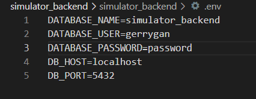

# Instructions for running backend

0. Make sure you can python and postgres installed on your local machine.

1. Setup your local POSTGRES database
- You can use the following to guide on how you can setup your local POSTGRES DV: https://medium.com/@rudipy/how-to-connecting-postgresql-with-a-django-application-f479dc949a11

2. Connect local POSTGRES database to Django application
- Navigate to ./simulator_backend/simulator_backend/ directory and add a .env file with the following environment variables:



3. Install dependencies
```
pip install -r requirements.txt
```

4. Apply migrations to your local DB.
- Navigate to ./simulator_backend and run the following command:
```
python manage.py migrate
```

5. Seed the database(add initial data).
- In the same directory as above, run the following command:
```
python manage.py loaddata seed_data001.json
```

6. Run server.
- In the same directory as above, run the following command:
```
python manage.py runserver
```

7. Voila. You can now interact with our API by making the appropriate API calls.
- Checkout this [link](https://docs.google.com/document/d/1mPsGafx3xefBldeQFl33UPGe8SpDAjI49Z4wJNDqltI/edit?usp=sharing) for our latest API documentation.